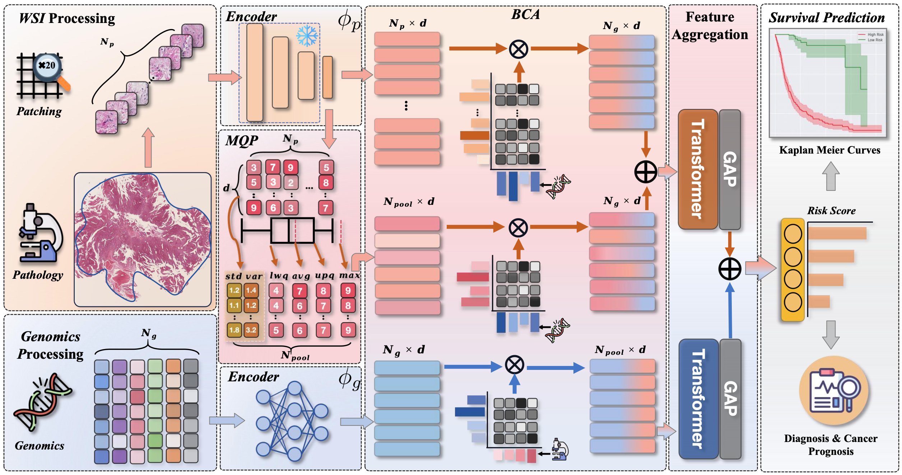

<h1>Counterfactual Bidirectional Co-Attention Transformer for Multimodal Survival Analysis</h1>

# Abstract

<details>
<summary> Read full abstract from CFBCT.



</summary>

Applying deep learning to predict patient survival outcomes using histological whole-slide images (WSIs) and genomic data is challenging due to the morphological and transcriptomic heterogeneity present in the tumor microenvironment. Current state-of-the-art models often display learning biases, primarily because the genomic knowledge used to guide directional feature extraction from WSIs may be non-critical or incomplete. This results in a suboptimal and sometimes myopic understanding of the overall pathological landscape, potentially overlooking crucial histological insights. To tackle these challenges, we propose the CounterFactual Bidirectional Co-Attention Transformer framework. By integrating a bidirectional co-attention layer, our framework fosters effective feature interactions between the different modalities and ensuring consistent identification of prognostic features from WSIs. Crucially, by employing counterfactual reasoning, our model quantifies multimodal survival analysis as causal relationships, thereby directly addressing and reducing bias effects, allowing for the examination of 'what-if' scenarios and providing a more robust understanding of feature relationships and their impact on survival outcomes. The improvement over this method is demonstrated by an average performance improvement of 1.9\%. Validated across eight diverse cancer benchmark datasets from The Cancer Genome Atlas (TCGA), our framework marks a significant advancement in overcoming the inherent limitations of current histology-genomic model learning approaches. Our code is released at https://github.com/.

</details>

## Hardware

- **Systems and Storage:** Linux system (Tested on Arch Linux) and at least 8TB of storage space (to accommodate raw and patch images of all types of cancer).
- **GPU**: NVIDIA GPU (Tested on Nvidia GeForce RTX 3090 x 4) with CUDA 11.7 and cuDNN 8.0

## Installation

- Python (3.7.13)
```txt
h5py==3.7.0
numpy==1.21.6
pandas==1.3.5
Pillow==9.3.0
opencv-python==4.6.0.66
openslide-python==1.2.0
scikit-learn==1.0.2
scipy==1.7.3
tensorboardX==2.6
torch==1.9.1
torchvision==0.10.1
```

# TCGA Data

## Download  Whole Slide Images

To download diagnostic and tissue WSIs (formatted as .svs files), please refer to the [NIH Genomic Data Commons Data Portal](https://portal.gdc.cancer.gov/) and use the [GDC Data Transfer Tool](https://docs.gdc.cancer.gov/Data_Transfer_Tool/Users_Guide/Data_Download_and_Upload/).

## Processing Whole Slide Images

1.  Segmenting on [OpenSlide's ](https://openslide.org/api/python/) downsampled WSI using Otsu's Segmentation. 

```bash
# Install OpenSlide on Linux
sudo apt-get install openslide-tools
sudo apt-get install python-openslide
```

2. Tiling non-overlapping 256 x 256 patches extracted from the segmented tissue regions.

>  All tiles were extracted at 0.5 micrometers / pixel (20x magnification)


```bash
python ./dataset/extract_patches.py \
      base_dir=$base_dir \
      dataset=$slide_dir \
      slide_dir=$slide_dir\
      tile_dir=$tile_dir \
      tile_size=256
```

3. Using  the pre-trained truncated [CTransPath]( https://github.com/Xiyue-Wang/TransPath) to encode the raw image patches into 768-dimensional feature vectors.

>  For each case, we saved there patche features as `.h5` files group by `Column = Case Id` from the organized clinical information `.csv` files in advance.  To extract features for each slide, use the following tool:

```bash
python ./dataset/extract_tile_features.py \
      extract_pretrain_path=$extract_pretrain_path \
      tile_path=$tile_path\
      save_path=$save_path\
      batch_size=$batch_size
```

4. The file structure involved in all processing is as follows:

````
|──DATA_ROOT_DIR 											# The base directory of all datasets
│   ├── BLCA                 					# Cancer type
│   │   ├── slide                   	# Raw WSIs downloaded using GDC
│   │   │   ├── a6b073a9-9226-4907-9edb-90070c68ae60
│   │   │   │  ├── TCGA-GV-A40G-01Z-00-DX1.AD1A709F-A10C-4E69-B4ED-6361777361FD.svs
│   │   │   ├── 94c5db73-5025-45c9-8023-1bbc0479426e
│   │   │   │  ├── TCGA-FD-A5BV-01Z-00-DX1.FD47C060-5104-45AC-95F8-0C4C5924FE26.svs...
│   │   ├── tile                      # Tiling images for each WSI
│   │   |    ├── TCGA-GV-A40G-01Z-00-DX1.AD1A709F-A10C-4E69-B4ED-6361777361FD
│   │   |    ├── TCGA-FD-A5BV-01Z-00-DX1.FD47C060-5104-45AC-95F8-0C4C5924FE26...
│   │   └── path_h5    								# Feature embeddings for each case
│   │   |    ├── TCGA-GV-A40G.h5
│   │   |    ├── TCGA-FD-A5BV.h5...
│   ├── BRCA                
│   │   ├── slide                   
│   │   │   ├── a4e25e73-263e-42a0-9cc2-5fa6fd09e083
│   │   │   │  ├── TCGA-BH-A0BD-01Z-00-DX1.CD4A6FC2-BA8C-4E30-972A-E6CD1BEAD8AD.svs
│   │   │   ├── 01dbcd23-40da-4f7e-9c48-8cdf11724863
│   │   │   │  ├── TCGA-AO-A0J5-01Z-00-DX1.20C14D0C-1A74-4FE9-A5E6-BDDCB8DE7714.svs...
│   │   ├── tile                      
│   │   |    ├── TCGA-BH-A0BD-01Z-00-DX1.CD4A6FC2-BA8C-4E30-972A-E6CD1BEAD8AD
│   │   |    ├── TCGA-AO-A0J5-01Z-00-DX1.20C14D0C-1A74-4FE9-A5E6-BDDCB8DE7714...
│   │   └── path_h5    
│   │   |    ├── TCGA-BH-A0BD.h5
│   │   |    ├── TCGA-AO-A0J5.h5...
````


## Download  Genomics Data

To download molecular feature data and other clinical metadata, please refer to the [cBioPortal](https://www.cbioportal.org/).

## Processing Genomics Data

- **Gene Families:**  Following previous work (e.g., [MCAT](https://github.com/mahmoodlab/MCAT)), the downloaded gene families containing mutation status, copy number variation, and RNA-Seq abundance were classified (by common features such as homology or biochemical activity) via the following gene families in MSigDB as 

  > 1) Tumor Suppression
  > 2) Oncogenesis
  > 3) Protein Kinases
  > 4)  Cellular Differentiation
  > 5)  Transcription
  > 6)  Cytokines and Growth

- **Pathways:** Other work was processed (e.g., [SurvPath](https://github.com/mahmoodlab/SurvPath)), i.e., utilizing Reactome and MSigDB Hallmarks pathway compositions, usually choosing pathways with more than 90% of the transcriptomics data.


# Training-Validation Splits

To evaluate the performance of the algorithm, we performed 5-fold cross-validation on each dataset (stratified by the location where the histologic slices were collected). Splits for each cancer type can be found in the `splits` folder, each containing splits_{k}.csv for k = 1 to 5. In each splits_{k}.csv, the first column corresponds to the TCGA case IDs used for training, and the second column corresponds to the TCGA case IDs used for validation.

# Running Example Experiment

# Citation

If you find our work useful in your research, please consider citing our paper at:

```
@article{
 
}
```
